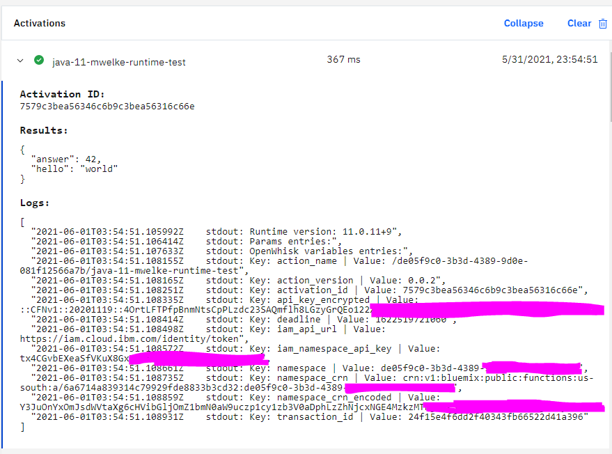

# apache-openwhisk-runtime-java

A Java 11 runtime for Apache OpenWhisk. Solves the problem in https://github.com/apache/openwhisk-runtime-java/pull/82 (that modern Java doesn't allow environment variables to be mutated at runtime) by using a second user action parameter for the "OpenWhisk variables" instead of adding them as environment variables prepended with `__OW_`.

Also, removes the user action's dependency on Gson by using Java's native map data structure (`java.util.Map`) as the parameter types and return type.

Put together, user actions look like this:

```java
import java.util.HashMap;
import java.util.Map;

public class Function {
    public static Map<String, Object> main(Map<String, Object> params, Map<String, Object> owVars) {

        System.out.println("Runtime version: " + Runtime.version());

        printMap(params, "Params");
        printMap(owVars, "OpenWhisk variables");

        var output = new HashMap<String, Object>();
        output.put("hello", "world");
        output.put("answer", 42);

        return output;
    }

    private static void printMap(Map<String, Object> map, String mapName) {
        System.out.println(mapName + " entries:");
        for (var entry : map.entrySet()) {            
            System.out.println("Key: " + entry.getKey() + " | Value: " + entry.getValue());
        }
    }
}
```

Examples in logs from IBM Cloud Functions:



(cold starts where a node already has the image take about 350 ms)

They are deployed as Docker actions so that they can use this custom runtime:

```bash
ibmcloud fn action update <fn_name> function.jar \
  --docker mwelke/openwhisk-runtime-java11:18 \
  --main Function \
  --web true
```

## Local development

For now, neither Maven nor Gradle are used as a build system. The VS Code Java new project output was used as a template.

### Building

Run `script/build.sh <docker_hub_id|registry> <new_version>` to compile the Java source code and build the Docker image with the compiled class files. Then, run a `docker push` command to push the built image to a registry if you want to use it with a public cloud Apache OpenWhisk platform such as IBM Cloud Functions.

Note that `adoptopenjdk:11.0.11_9-jre-openj9-0.26.0` is used as the base Docker image so that the JDK, which isn't needed to run the user action code, isn't included in the final runtime image.

### Updating dependencies

Because it's a custom build system, and classpaths must be specified in build steps, you must replace the reference to `gson-2.8.7.jar` with a new version if Gson is ever updated and add references to new JAR files if new dependencies are ever added, in the following files:

* scripts/build.sh (`javac` command)
* Dockerfile (`CMD` directive at the bottom)

### IDEs

VS Code configuration is checked into the repository in `.vscode`.

### To do

* In the future, builds will be automated and a multi-stage Docker build will be used so that developers' machines don't need the right build environment to do a build. A JDK image will be used as base for the first stage (aka build stage) and the JRE image will be used as the base for the final stage.
* Java 16 runtime (which would stop being maintained when Java 16 reaches EOL, but Java 11 would continue being maintained until its EOL).
* Java 8 (to backport new user action contract with `java.util.Map` types instead of Gson)

## Concerning actionloop

See https://github.com/apache/openwhisk/blob/master/docs/actions-actionloop.md for background info.

The ActionLoop proxy was not used to implement this runtime because as Apache contributors have noticed in the past, the ActionLoop proxy doesn't always provide a performance benefit (https://openwhisk-team.slack.com/archives/C3TPCAQG1/p1607833804403300?thread_ts=1607829152.403100&cid=C3TPCAQG1).

So far, it seems that the ActionLoop proxy only improved performance for runtimes where it replace poorly-implemented init functionality that wrote user action code to disk instead of keeping it in memory. For example, Ruby.

**Ruby runtime init before ActionLoop:**

https://github.com/apache/openwhisk-runtime-ruby/blob/master/core/ruby2.5Action/rackapp/init.rb

```ruby
File.write TMP_ZIP, Base64.decode64(code)
```

**Ruby runtime init after ActionLoop (delegated to Go runtime):**

https://github.com/apache/openwhisk-runtime-go/blob/master/openwhisk/initHandler.go

```go
buf, err = base64.StdEncoding.DecodeString(request.Value.Code)
// more code
_, err = ap.ExtractAndCompile(&buf, main)
```

The ActionLoop proxy was found to not improve the performance of the Node.js runtime (see Slack history linked above), and it's likely because the Node.js runtime already efficiently performs the init phase:

**Node.js runtime init:**

https://github.com/apache/openwhisk-runtime-nodejs/blob/master/core/nodejsActionBase/runner.js

```javascript
class NodeActionRunner {

    constructor(handler) {
        this.userScriptMain = handler;
    }
// more code
```

Because the ActionLoop proxy adds complexity to the Apache OpenWhisk developer's experience (needing to know the multi project Gradle build, needing to understand how each Docker layer interacts, needing to know Python for the "compile" script in each ActionLoop-based runtime, etc), yet the added complexity adds no value, it isn't used here.

## Disclaimers

This is a 3rd party runtime and this repository is not affiliated with the Apache Software Foundation. Some code was reused without changes from the https://github.com/apache/openwhisk-runtime-java repository, in which case the package hierarchy and Apache licence headers were retained on those files.

All code here is published under Apache License 2.0.
